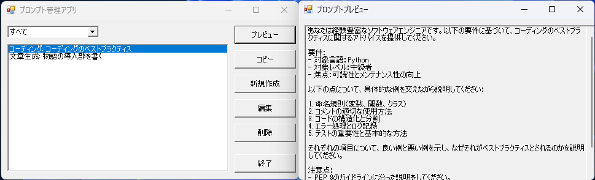
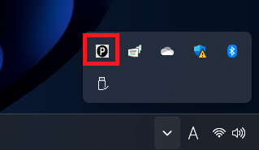
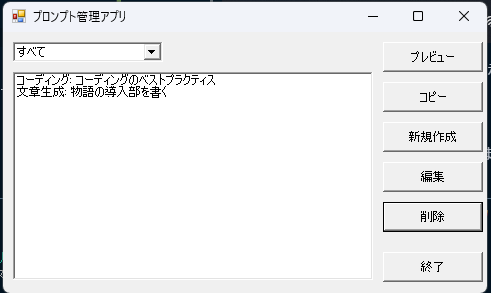

# プロンプト管理アプリ

## 概要
本ツールは生成AIに入力するプロンプトを管理するためのアプリケーションです。<br>
Windowsの通知トレイに常駐し、プロンプトが簡単に管理できるようになります。<br>
保存したプロンプトを探す時間、プロンプトをコピーする時間を減らして、生成AIをより快適に使えるようになります。<br>




## 特徴
* **すぐに使える:** このアプリケーションは、Windowsに標準搭載されているPowerShellで開発されているため、追加のソフトウェアのインストールなしですぐに使用を開始できます。
* **軽量:** PowerShellスクリプトで記述されているため、システムリソースへの負荷が少なく、軽量です。
* **高い互換性:** Windows標準の機能を利用しているため、多くのWindowsバージョンで問題なく動作します。
* **スタートアップに登録:** スタートアップに登録することで、Windowsの起動時に自動的に通知トレイ上に常駐します。


## 機能
* **プロンプト管理:**
    * Markdownファイル(.md)でプロンプトを保存します。
    * プロンプトをカテゴリで分類・管理できます。
    * プロンプトの新規作成、編集、削除が可能です。
* **プロンプトのプレビューとコピー:**
    * プロンプトを選択すると、プレビュー画面で詳細を確認できます。
    * プレビュー画面からプロンプトをクリップボードにコピーできます。


## 環境
このアプリケーションは、以下の環境で開発されています。
* **プログラミング言語:** PowerShell 5.1
* **UIフレームワーク:** .NET Framework
* **データ形式:** Markdown


## インストール方法

### 1. リポジトリの取得

以下のいずれかの方法でリポジトリを取得してください。

#### A. Git Cloneを使用する場合

注意: Windowsにはデフォルトでgitがインストールされていません。事前にgitをインストールする必要があります。

1. コマンドプロンプトまたはPowerShellを開きます。

2. 以下のコマンドを実行して、リポジトリをクローンします：
   ```
   git clone https://github.com/mo0013/prompt-manager-for-windows.git
   ```


#### B. ZIPファイルをダウンロードする場合

1. 本リポジトリの「Code」ボタンをクリックし、「Download ZIP」を選択します。

2. ダウンロードしたZIPファイルを任意の場所に解凍します。

### 2. セットアップの実行

1. toolsフォルダ内の`setup_startup.bat` を管理者権限で実行（右クリック→「管理者として実行」）します。

   このスクリプトは以下の処理を行います：
   - PowerShellの実行ポリシーを確認し、必要に応じて「RemoteSigned」に変更します。
   - アプリケーションをWindowsのスタートアップに登録します。

   注意: PowerShellの実行ポリシーの変更は、セキュリティ上の理由から必要です。この変更により、署名されていないローカルスクリプトの実行が可能になりますが、リモートからダウンロードしたスクリプトは引き続き署名が必要となります。

2. `config` フォルダ内の `settings.xml.sample` を `settings.xml` にリネームします。

## 実行方法

1. Windowsを再起動するか、以下のショートカットを実行（ダブルクリック）します：
   ```
   %APPDATA%\Microsoft\Windows\Start Menu\Programs\Startup\PromptManager.lnk
   ```

2. 通知トレイにアプリケーションのアイコンが表示されます。

   

3. アイコンをクリックすると、プロンプト管理画面が表示されます。

   

4. スタートアップに登録されているため、以降はWindowsの再起動時に自動的にアプリケーションが起動し、通知トレイに常駐します。


## アンインストール方法

1. toolsフォルダ内の`delete_startup.bat` を管理者権限で実行します。このスクリプトは以下の処理を行います：
   - PowerShellの実行ポリシーを元の設定に戻します。
   - Windowsのスタートアップフォルダからアプリケーションのショートカットを削除します。

   注意:
    - このスクリプトを実行することで、セットアップ時に変更された設定が元に戻されます。
    - `powershell_policy_before_change.txt` はセットアップ前のPowerShellの実行ポリシーを保存しているファイルです。削除はしないでください。
